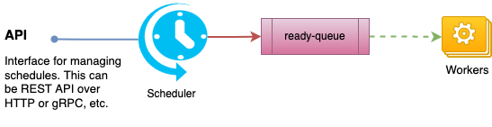

## Problem

At work, I was constantly running into use-cases where things needed to be done
at a pre-defined time in the future and sometimes in a recurring manner (Similar to
unix cron[^1]).

Some example use-cases:

1. Send a reminder notification to a user after 3 days.
2. Execute some background job every hour.
3. Process some event after a configurable delay.

These use-cases existed across few different products, so it made sense to think
of this problem in a generic manner & reduce its overall requirement to just _emitting
events based on schedules_.

The system also needed to be reliable & scalable for following reasons:

- These use-cases are time-sensitive. If the system is down for an hour, all the events
  that were expected to be generated in that window would be delayed.
- We were expecting to have few million active schedules at any given time.

To summarise, _We needed a system that generates events based on schedules, has APIs to manage (i.e., CRUD) those schedules, is horizontally scalable, is highly-available (HA) & has no Single Point of Failure (SPOF)._

Let's say a schedule looks like this:

```go
type Schedule struct {
    ID      string `yaml:"id"`
    Crontab string `yaml:"crontab"`
    Payload string `yaml:"payload"`
}
```

An example schedule:

```yaml
id: "schedule1"
crontab: "@every 1h"
payload: '{"user": 1234, "type": "renewal_reminder"}'
```

If the above schedule is created at `t`, we expect the scheduler to publish messages (e.g., over Kafka) with the following data at `t1=t+1h`, `t2=t1+1h`, and so on:

```yaml
id: "schedule1-<tx>"
generated_at: <tx>
schedule_id: "schedule1"
payload: '{"user": 1234, "type": "renewal_reminder"}'
```

Systems interested in the schedules would consume these messages and execute the business logic based on `payload`.



## Solution

A crontab[^2] is just a compact representation of an _ordered finite/infinite set of timestamps_. It is usually an infinite set (e.g., `@every 1d`, `* * * * *`) or can be a finite set with some non-standard extensions (e.g., `@at 1647067401`). If we know a point in this series (either starting point or some mid point), we can compute the next timestamp using the crontab.

Implementation-wise, we can think of any entry in this series as a job which should be executed at that point in time. And the execution of that job will create another job to be executed at the next timestamp computed based on the crontab, and so on.

So, what we really need for building this system, is a job-queue where jobs are ready for dequeue at a specific time, instead of being ready as soon as enqueued.

So, this is rougly the interface we need to implement.

```go
type DelayQ interface {
    // Delay should enqueue item and ensure it becomes ready at
    // the given 'readyTime'.
    Delay(readyTime time.Time, data []byte) error

    // Run should continously look for ready items and invoke
    // handle for each. This includes any item that was enqueued
    // with readyTime <= time.Now().
    Run(handle HandlerFn) error
}

// HandlerFn is invoked by DelayQ for every ready item.
type HandlerFn func(t time.Time, data []byte) error
```

The value of `HandlerFn` defines the "job" that needs to be done at scheduled timestamps.
For our scheduler use-case, the `HandlerFn` should:

1. Publish the message with payload from the schedule.
2. Compute the next execution time and enqueue a job to be ready at that time.

There are obviously multiple approaches to implementing the `DelayQ` interface ranging from in-memory priority-queue based solutions to distributed database solutions. I discuss few approaches in [another post](). For the purpose of this discussion, we will assume a `DelayQ` implementation exists and an instance is available as `dq`. We will also assume, there is a schedule definition storage that can be accessed using `saveSchedule`, `fetchSchedule`, etc.

With all this introduction and assumptions, we are ready to get to the workings of the system.

### Creating

We can create a schedule using:

```go
func createSchedule(sc Schedule) error {
    // enqueue the first execution point into delay-queue so
    // that we get a callback at that time.
    computeRelativeTo := time.Now()
    nextExecutionAt := ComputeNext(computeRelativeTo, sc.Crontab)
    err := dq.Delay(nextExecutionAt, sc.ID)
    if err != nil {
        return err
    }

    // store into some persistent storage.
    // this is done after enqueue to make sure we don't end up
    // with schedules that were not enqueued properly and retry
    // is also not possible.
    return saveSchedule(sc)
}
```

### Updating

Updating can be bit tricky if changing the `crontab` of an active schedule is allowed. Because updating the crontab changes the timeline of the schedule and most-likely makes the already inserted execution points in `DelayQ` invalid.

One way to handle this is to maintain a version on the schedule which changes on every update. This version should also be stored in the delay-queue as part of `data`. When it becomes ready, the `handle` function can compare the version from the `data` passed to the current version of the schedule-definition. If they do not match, ignore the callback.

### Deleting

Deletion is as simple as removing the schedule definition from the storage. We don't really need to do anything about the execution point added to the delay-queue because the `handle` function ignores the callback if schedule is not found.

### Execution

As per our `DelayQ` interface contract, actual execution of the created schedules requires
the `DelayQ.Run()` function to be called somewhere. This is the "worker" part of the system.

The `DelayQ.Run()` function can be setup either on its own goroutine or as an independent
worker process as well.

The following snippet shows the worker setup.

```go
package main

func main() {
    // launch the worker threads that continously look for ready-items
    // & invoke handler for those.
    if err := dq.Run(handler); err != nil {
        log.Fatalf("delayq workers exited: %v", err)
    }
}

func handle(t time.Time, data []byte) error {
    scheduleID := string(data)
    scheduleDef, found := fetchSchedule(scheduleID)
    if !found {
        // the schedule was probably deleted. so nothing to do.
        return nil
    }

    // next execution point should be computed relative to current
    // execution to establish the correct timeline that matches the
    // crontab.
    nextAt := ComputeNext(t, scheduleDef.Crontab)
    err := dq.Delay(nextAt, scheduleID)
    if err != nil {
        return err
    }

    // if enqueue is successful, we publish the event to notify external
    // systems. if this fails, the DelayQ will end-up retrying.
    return publishEvent(Event{
        ID: fmt.Sprintf("%s-%s", scheduleID, t.Unix()),
        Payload: scheduleDef.Payload,
        ScheduleID: scheduleID,
        GeneratedAt: t,
    })
}
```

With this setup running, we should start seeing events being published as expected by the system for any active schedules.

## Final Thoughts

This roughly outlines the system I built at work to solve the problem stated. At the time of writing this post, this system has been in production close to a year without a single incident of any kind & has ~30 million active schedules with more being creatd (~5k new schedules/minute) everyday. 🤩

While this has worked really well for our use-cases, there is definitely room for improvements. For example, if the schedules have a really high resolution (e.g., `@every 1s`), this chaining approach (one execution scheduling the next point) can cause permenently lagged timeline if one execution gets lagged by more than `1s`.

This system can also be improved by adding some additional features. For example, a configuration in schedule definition to have deadlines for execution (i.e., ignore the execution if it is delayed by more than 1m).

[^1]: https://man7.org/linux/man-pages/man8/cron.8.html
[^2]: https://en.wikipedia.org/wiki/Cron#CRON_expression
